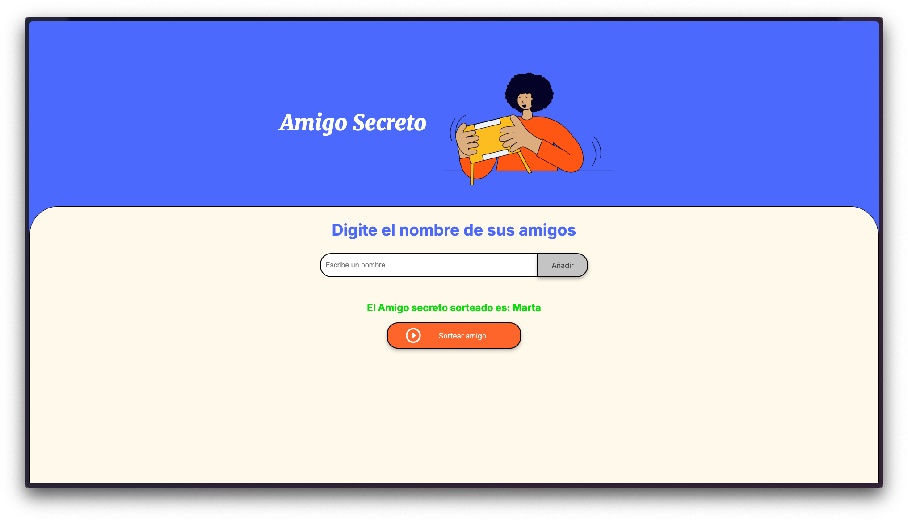

# Amigo Secreto

Este es un proyecto de una aplicación web para organizar un juego de "Amigo Secreto". La aplicación permite agregar
amigos, listar los amigos agregados y sortear un amigo secreto de manera aleatoria.

## Características

- **Agregar Amigos**: Permite agregar nombres de amigos a una lista.
- **Listar Amigos**: Muestra la lista de amigos agregados.
- **Sortear Amigo Secreto**: Sortea un amigo secreto de la lista de amigos agregados y muestra el resultado.

## Tecnologías Utilizadas

- **HTML**: Estructura de la página web.
- **CSS**: Estilos de la página web.
- **JavaScript**: Lógica de la aplicación.

## Estructura del Proyecto

- `index.html`: Contiene la estructura HTML de la aplicación.
- `style.css`: Contiene los estilos CSS para la aplicación.
- `app.js`: Contiene la lógica en JavaScript para la aplicación.

## Instrucciones de Uso

1. Clona el repositorio en tu máquina local.
2. Abre el archivo `index.html` en tu navegador web.
3. Ingresa el nombre de un amigo en el campo de texto y haz clic en "Añadir" para agregarlo a la lista.
4. Una vez que hayas agregado todos los amigos, haz clic en "Sortear amigo" para realizar el sorteo del amigo secreto.

## Ejemplo de Uso

1. Ingresa el nombre "Juan" y haz clic en "Añadir".
2. Ingresa el nombre "María" y haz clic en "Añadir".
3. Haz clic en "Sortear amigo" para ver quién es el amigo secreto.

## Capturas de Pantalla

- **Captura de Pantalla 1**: Vista de la aplicación web.
  

- **Captura de Pantalla 2**: Ejemplo de sorteo de amigo secreto.
  

- **Captura de Pantalla 3**: Ejemplo de sorteo de amigo secreto completo.
  

- **Captura de Pantalla 4**: Ejemplo de sorteo de amigo secreto terminado.
  